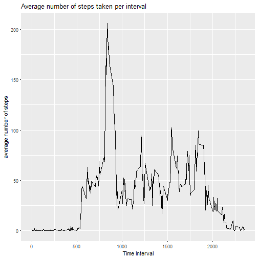
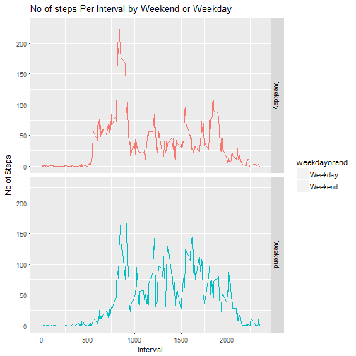

## Load the data (i.e. read.csv())

Process/transform the data (if necessary) into a format suitable for your analysis


```r
## 2. Set working directory

fileloc <- "D:/Data science/Course 5/Week 2"
setwd(fileloc)

## 3. Download Data

## download data and unzip it
    download.file(
            "https://d396qusza40orc.cloudfront.net/repdata%2Fdata%2Factivity.zip", 
            "repdata%2Fdata%2Factivity.zip")
## 4. Unzip Data
    
unzip("repdata%2Fdata%2Factivity.zip")
```

```
## Error in unzip("repdata%2Fdata%2Factivity.zip"): cannot open file './activity.csv': Permission denied
```

```r
## Read Data

activity <- read.csv("activity.csv")

## covert dates from factor to date

activity$date <-as.Date(as.character(activity$date,format='%d/%m/%Y'))

## Create a data frame with complete activities 
complete_activity <- activity[complete.cases(activity), ]
```

## What is mean total number of steps taken per day?


```r
## Calculate the total number of steps taken per day
## Aggreegate using “aggregate” function, sales is the col. to be aggregated by year 
stepsperday <- aggregate(steps ~ date,complete_activity,sum)

library(ggplot2)

## Make a histogram of the total number of steps taken each day
g <- ggplot (stepsperday, aes(steps))
g+geom_histogram()+labs(title = "Histogram of total number of steps per day") + labs(x="Steps per day") 
```

```
## `stat_bin()` using `bins = 30`. Pick better value with `binwidth`.
```


```r
## Calculate and report the mean and median of the total number of steps taken per day
mean(stepsperday$steps)
```

```
## [1] 10766.19
```

```r
## Calculate and report the mean and median of the total number of steps taken per day
median(stepsperday$steps)
```

```
## [1] 10765
```

##What is the average daily activity pattern?


```r
##Make a time series plot (i.e. type = "l") of the 5-minute interval (x-axis) and the average number of steps taken, averaged across all days (y-axis)

## calculate mean per interval
mean_per_interval <- aggregate(steps ~ interval,complete_activity,mean)

## plot time series plot
g <- ggplot (mean_per_interval, aes(interval, steps))
g+geom_line()+labs(title = "Average number of steps taken per interval") + labs(x="Time Interval") + labs(y="average number of steps")
```



```r
##Which 5-minute interval, on average across all the days in the dataset, contains the maximum number of steps?

## The interval with the highest avg steps is
mean_per_interval[which.max(mean_per_interval$steps), ]
```

```
##     interval    steps
## 104      835 206.1698
```


## Imputing missing values


```r
##Calculate and report the total number of missing values in the dataset (i.e. the total number of rows with NAs)

missing_activities <- complete_activity <- activity[!complete.cases(activity), ]
nrow(missing_activities)
```

```
## [1] 2304
```


```r
## Idenitify rows with missing values for steps and replace them with mean value for relevant interval

for (i in 1:nrow(activity)) 
  {
    if(is.na(activity$steps[i])) 
  {
        meansteps <- mean_per_interval$steps[which(mean_per_interval$interval == activity$interval[i])]
        activity$steps[i] <- meansteps 
  }
}
```

Make a histogram of the total number of steps taken each day and Calculate and report the mean and median total number of steps taken per day. Do these values differ from the estimates from the first part of the assignment? 


```r
## Calculate the total number of steps taken per day
## Aggreegate using “aggregate” function, sales is the col. to be aggregated by year 
stepsperday_impu <- aggregate(steps ~ date,activity,sum)

## Make a histogram of the total number of steps taken each day
g <- ggplot (stepsperday_impu, aes(steps))
g+geom_histogram()+labs(title = "Histogram of total number of steps per day with imputed data") + labs(x="Steps per day") 
```

```
## `stat_bin()` using `bins = 30`. Pick better value with `binwidth`.
```


```r
## Calculate and report the mean and median of the total number of steps taken per day
mean(stepsperday_impu$steps)
```

```
## [1] 10766.19
```

```r
## Calculate and report the mean and median of the total number of steps taken per day
median(stepsperday_impu$steps)
```

```
## [1] 10766.19
```

## What is the impact of imputing missing data on the estimates of the total daily number of steps?

No Impact to the mean and median due t imputing missing values

## Are there differences in activity patterns between weekdays and weekends?


```r
## add a day factor variable
activity$day <- weekdays(activity$date)

weekday <- function(day)
  {
    if(day %in% c("Monday", "Tuesday", "Wednesday","Thursday","Friday")) 
      {
      weekdayorend = 'Weekday'
    } else 
      {
    weekdayorend = 'Weekend'

    }

weekdayorend
}

## add a factor variable for weekday or weekend
activity$weekdayorend <- as.factor(sapply(activity$day, weekday))


## calculate mean per weekend or weekday
mean_per_day <- aggregate(steps ~ interval+weekdayorend,activity,mean)

## plot time series plot
g <- ggplot(mean_per_day, aes(interval, steps)) +
    geom_line(stat = "identity", aes(colour = weekdayorend)) +
     facet_grid(weekdayorend ~ .,) +
    labs(x="Interval", y=expression("No of Steps")) +
    ggtitle("No of steps Per Interval by Weekend or Weekday")

print(g)
```



```r
print("There is difference between weekday and weekedn activities. Weekdays are more active than in monring whereas weekend seems to start late but higher activity throughout the day")
```

```
## [1] "There is difference between weekday and weekedn activities. Weekdays are more active than in monring whereas weekend seems to start late but higher activity throughout the day"
```


